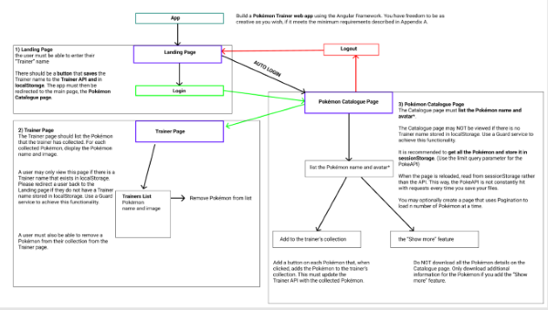
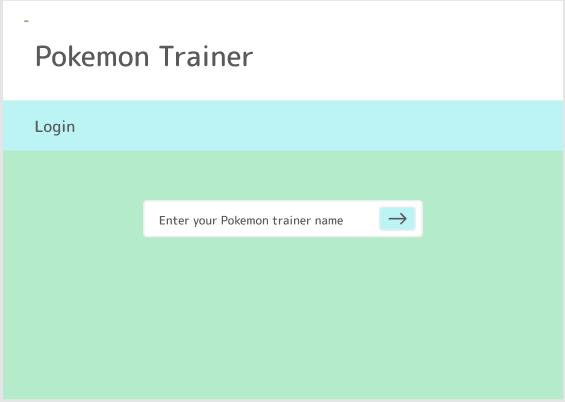
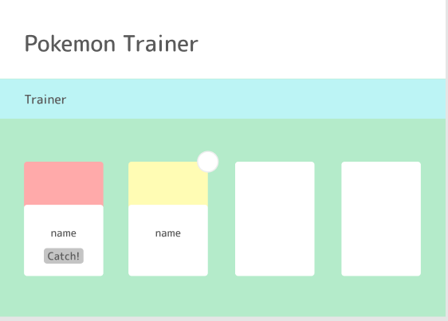

# pokemon-trainer

[](https://github.com/RichardLitt/standard-readme)
[](https://tnnb-pokemon-trainer.herokuapp.com/)


Noroff Java Fullstack Assignment 4 - Pokémon Trainer web app built with the Angular Framework

Pokemon Trainer goals:

- Login page
- List of Pokemons: Catalogue page
- "Catch" a pokemon
- "Catched" pokemons in the profile page

Login built with API storage, Angular router routing and Guard service, [Pokémon API](https://pokeapi.co/) used for Pokémon data that we decided to use only with the maximum results of one call.


## Table of Contents

- [Install](#install)
- [Usage](#usage)
- [Component Tree](#component-tree)
- [UI-sketch](#ui-sketch)
- [Maintainers](#maintainers)
- [Contributing](#contributing)
- [License](#license)

## Install

Clone the repository locally and run ```npm install``` inside the cloned directory.

## Usage
Use [Angular-CLI](https://angular.io/cli) to
Run ```ng serve -o``` in the same directory to start the application in your default browser.

## Component-Tree


## UI-Sketch



## Maintainers

[@Azruim(Nico Behnen)](https://github.com/Azruim)
[@teemunasanen](https://github.com/teemunasanen)

## Contributing
PRs accepted.

Small note: If editing the README, please conform to the [standard-readme](https://github.com/RichardLitt/standard-readme) specification.

## License

MIT © 2022 Nico Behnen & Teemu Näsänen
